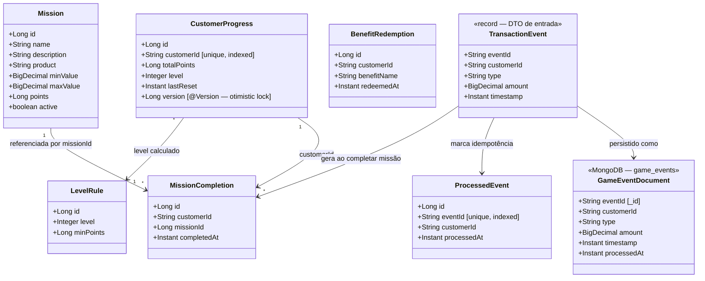
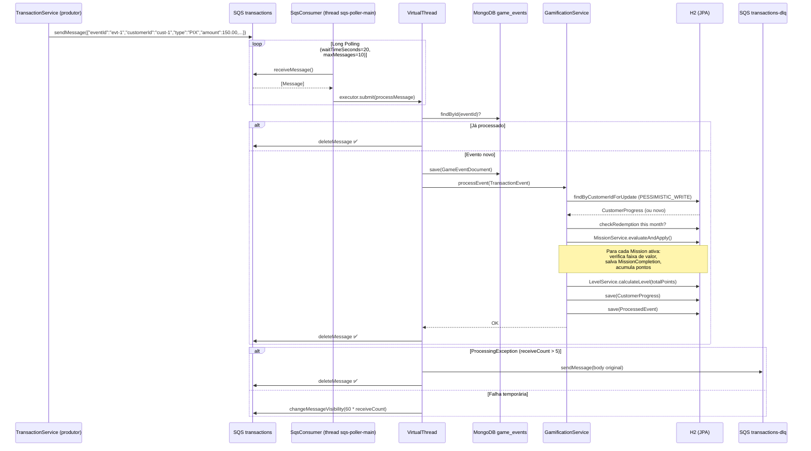

# 🎮 GameService

Microserviço worker de **gamificação** que consome eventos de transação PIX da fila AWS SQS e aplica regras de missões, pontos e níveis para cada cliente. Expõe endpoints do Actuator em `http://localhost:8082`.

---

## 📋 Índice

1. [Visão Geral](#1-visão-geral-do-projeto)
2. [Arquitetura do Sistema](#2-arquitetura-do-sistema)
3. [Diagramas UML](#3-diagramas-uml)
4. [Serviços e Comunicação](#4-serviços-e-comunicação)
5. [Modelo de Dados](#5-modelo-de-dados)
6. [Como Subir o Projeto (Docker)](#6-como-subir-o-projeto-docker)
7. [Testando as APIs](#7-testando-as-apis)
8. [Estrutura de Pastas](#8-estrutura-de-pastas)
9. [Variáveis de Ambiente](#9-variáveis-de-ambiente)
10. [Troubleshooting](#10-troubleshooting)
11. [Próximos Passos](#11-próximos-passos-e-melhorias)

---

## 1. 🎯 Visão Geral do Projeto

| Campo | Valor |
|---|---|
| **Nome** | `game-service` |
| **GroupId / ArtifactId** | `com.gameservice` / `game-service` |
| **Versão** | `0.0.1-SNAPSHOT` |
| **Java** | 21 |
| **Spring Boot** | 4.0.6 |
| **Porta** | 8082 |
| **Tipo** | Worker microservice (sem controllers REST próprios) |

### Problema que resolve

Bancos e fintechs querem engajar clientes que realizam transações PIX, recompensando-os com **pontos** e **níveis** sem poluir os serviços de pagamento com lógica de negócio de gamificação. O `GameService` resolve isso de forma assíncrona:

1. O serviço de transações publica um evento JSON na fila SQS `transactions`.
2. O `GameService` consome os eventos com **long-polling**, processa as regras de missões e atualiza o progresso do cliente.

### Principais funcionalidades

- 📨 **Consumo assíncrono de SQS** com long-polling configurável e **virtual threads** (Java 21)
- 🏅 **Avaliação de missões PIX** por faixa de valor (Small / Medium / Large)
- 📈 **Cálculo automático de nível** baseado em pontos acumulados
- 🔁 **Idempotência** dupla: MongoDB + H2 (`processed_event`)
- ☠️ **Dead Letter Queue (DLQ)** automático após 5 tentativas (`transactions-dlq`)
- 🔄 **Reset mensal** de pontos e nível
- 🩺 **Actuator** expondo `health`, `info`, `metrics`, `prometheus`

### Tecnologias utilizadas

| Tecnologia | Versão | Uso |
|---|---|---|
| Java | 21 | Linguagem / Virtual Threads |
| Spring Boot | 4.0.6 | Framework |
| Spring Data JPA | (managed) | Entidades relacionais (H2) |
| H2 Database | (managed) | BD in-memory para estado do jogo |
| Spring Data MongoDB | (managed) | Registro de eventos brutos |
| AWS SDK v2 SQS | 2.21.0 | Consumo da fila de transações |
| Micrometer + Prometheus | (managed) | Métricas |
| Logstash Logback Encoder | 8.0 | Logs JSON estruturados |
| Jackson JSR310 | (managed) | Serialização de `Instant` / `LocalDate` |
| Testcontainers (MongoDB) | 1.19.0 | Testes de integração |
| LocalStack | 3.0 | Emulação local da AWS SQS |
| MongoDB | 6.0 | Persistência de eventos |
| Redis | 7 | Infraestrutura reservada (docker-compose) |

---

## 2. 🏛️ Arquitetura do Sistema

### Diagrama de Arquitetura

```mermaid
flowchart TD
    subgraph Produtor["Produtor (externo)"]
        TX[TransactionService\nou qualquer producer SQS]
    end

    subgraph AWS_Local["LocalStack :4566 (SQS)"]
        SQS["🗳️ transactions\nhttp://localstack:4566/000000000000/transactions"]
        DLQ["☠️ transactions-dlq\nhttp://localstack:4566/000000000000/transactions-dlq"]
    end

    subgraph GameService["game-service :8082"]
        direction TB
        RUNNER[StartupRunner\nApplicationRunner]
        CONSUMER[SqsConsumer\nlong-poll loop]
        VT[VirtualThreadExecutor\nJava 21]
        SERVICE[GamificationService\n@Transactional]
        APP[GameApplicationService\norchestrator]
        MISSION[MissionService]
        LEVEL[LevelService]
        REDEMPTION[RedemptionService]
        ACTUATOR["/actuator/health\n/actuator/metrics\n/actuator/prometheus"]
    end

    subgraph H2["H2 In-Memory (JPA)"]
        CP[customer_progress]
        MS[mission]
        MC[mission_completion]
        LR[level_rule]
        BR[benefit_redemption]
        PE[processed_event]
    end

    subgraph Mongo["MongoDB :27017 — game_db"]
        GE[game_events]
    end

    subgraph Redis["Redis :6379"]
        RD[(redis — reservado)]
    end

    TX -->|JSON TransactionEvent| SQS
    RUNNER --> CONSUMER
    CONSUMER -->|poll maxMessages=10\nwaitTimeSeconds=20| SQS
    SQS --> VT
    VT --> SERVICE
    SERVICE --> APP
    APP --> MISSION
    APP --> LEVEL
    APP --> REDEMPTION
    APP --> Mongo
    APP --> H2
    SERVICE -->|receiveCount > 5| DLQ
    CONSUMER -->|deleteMessage| SQS
```

### Componentes e responsabilidades

| Componente | Responsabilidade |
|---|---|
| `StartupRunner` | `ApplicationRunner` que inicia a thread `sqs-poller-main` com delay configurável (padrão 5 s) |
| `SqsConsumer` | Loop infinito de long-polling na fila SQS, submete cada mensagem a uma virtual thread |
| `GamificationService` | `@Service @Transactional` — ponto de entrada para processar um `TransactionEvent` |
| `GameApplicationService` | Orquestrador de domínio: reset mensal, idempotência, missões, nível, MongoDb save |
| `MissionService` | Avalia missões ativas contra o valor do PIX e acumula pontos |
| `LevelService` | Calcula o nível do cliente com base em `LevelRule`s do banco |
| `RedemptionService` | Verifica se o cliente já resgatou benefício no mês corrente |
| `BootstrapDataInitializer` | `@PostConstruct` que semeia as missões e regras de nível padrão no H2 |
| `SqsConfig` | Configura `SqsClient` (AWS SDK v2) e `ExecutorService` de virtual threads |
| `RepositoryConfig` | Separa repositórios JPA dos MongoDB para evitar conflito de auto-configuração |
| `SerializationConfig` | `ObjectMapper` com `JavaTimeModule` e `WRITE_DATES_AS_TIMESTAMPS=false` |

### Padrões de arquitetura identificados

- **Microserviço worker** (sem REST controllers, apenas consumidor assíncrono)
- **Event-Driven Architecture** via SQS
- **Idempotência** garantida em dois níveis (MongoDB + H2)
- **CQRS implícito**: leitura com `PESSIMISTIC_WRITE` lock para evitar concorrência
- **Dead Letter Queue** com backoff exponencial de visibilidade
- **Virtual Threads** (Java 21) para processamento paralelo eficiente
- **Dual-store**: MongoDB para log de eventos brutos, H2 para estado do jogo

---

## 3. 📐 Diagramas UML

### 3.1 Diagrama de Classes — Domínio (H2 JPA)



### 3.2 Diagrama de Sequência — Fluxo de Processamento de Evento



### 3.3 Diagrama de Componentes — Camadas

```mermaid
graph TB
    subgraph Infrastructure Layer
        SQS_INFRA[SqsConsumer\n+ SqsConfig]
        BOOT[BootstrapDataInitializer]
        RUNNER[StartupRunner]
        REPO_JPA[JPA Repositories\nCustomerProgress / Mission\nMissionCompletion / LevelRule\nBenefitRedemption / ProcessedEvent]
        REPO_MONGO[MongoRepository\nGameEventRepository]
    end

    subgraph Application Layer
        APP_SVC[GameApplicationService\norchestrador]
    end

    subgraph Service Layer
        GAMIF[GamificationService @Service]
        MSVC[MissionService]
        LSVC[LevelService]
        RSVC[RedemptionService]
    end

    subgraph Domain Layer
        ENTITIES[Entities JPA\nCustomerProgress\nMission\nMissionCompletion\nLevelRule\nBenefitRedemption\nProcessedEvent]
        DOCUMENT[GameEventDocument\nMongoDB]
        DTO[TransactionEvent record]
    end

    SQS_INFRA -->|chama| GAMIF
    RUNNER -->|inicia| SQS_INFRA
    GAMIF --> APP_SVC
    APP_SVC --> MSVC
    APP_SVC --> LSVC
    APP_SVC --> RSVC
    APP_SVC --> REPO_JPA
    APP_SVC --> REPO_MONGO
    MSVC --> REPO_JPA
    LSVC --> REPO_JPA
    RSVC --> REPO_JPA
    REPO_JPA --> ENTITIES
    REPO_MONGO --> DOCUMENT
    BOOT -->|@PostConstruct seed| REPO_JPA
```

---

## 4. 🔗 Serviços e Comunicação

### Microserviço: game-service

| Atributo | Valor |
|---|---|
| **Porta** | 8082 |
| **Tipo de comunicação** | Consumidor SQS (pull assíncrono) |
| **Fila principal** | `http://localstack:4566/000000000000/transactions` |
| **DLQ** | `http://localstack:4566/000000000000/transactions-dlq` |

### Endpoints HTTP disponíveis (Actuator)

| Método | URL | Descrição |
|---|---|---|
| `GET` | `http://localhost:8082/actuator/health` | Status do serviço |
| `GET` | `http://localhost:8082/actuator/info` | Informações da aplicação |
| `GET` | `http://localhost:8082/actuator/metrics` | Lista de métricas disponíveis |
| `GET` | `http://localhost:8082/actuator/prometheus` | Métricas no formato Prometheus |

> ⚠️ O `GameService` **não expõe REST controllers próprios**. Toda a entrada de dados é via mensagens SQS.

### Formato da mensagem SQS (TransactionEvent)

```json
{
  "eventId": "evt-abc-123",
  "customerId": "cust-001",
  "type": "PIX",
  "amount": 150.00,
  "timestamp": "2025-04-28T10:00:00Z"
}
```

> ⚠️ **Apenas eventos com `"type": "PIX"` são processados.** Outros tipos são descartados silenciosamente.

### Fluxo de dados entre componentes

```
Producer SQS
    └─► SQS (transactions)
            └─► SqsConsumer (poll a cada 500 ms, aguarda até 20 s por batch)
                    └─► VirtualThread
                            ├─► MongoDB: idempotência + log raw
                            ├─► H2 (JPA): progresso, missões, nível
                            └─► SQS: delete ou DLQ (falhas > 5 tentativas)
```

---

## 5. 💾 Modelo de Dados

### 5.1 Entidades JPA — H2 In-Memory

#### `customer_progress`

| Coluna | Tipo | Descrição |
|---|---|---|
| `id` | BIGINT PK AUTO | Identificador interno |
| `customerId` | VARCHAR UNIQUE INDEX | ID do cliente |
| `totalPoints` | BIGINT | Pontos acumulados no mês |
| `level` | INT | Nível atual (1–5) |
| `lastReset` | TIMESTAMP | Data do último reset mensal |
| `version` | BIGINT | Versão para optimistic lock |

#### `mission`

| Coluna | Tipo | Descrição |
|---|---|---|
| `id` | BIGINT PK AUTO | Identificador |
| `name` | VARCHAR | Nome da missão |
| `description` | VARCHAR | Descrição |
| `product` | VARCHAR | Produto alvo (ex: `PIX`) |
| `minValue` | DECIMAL | Valor mínimo da transação |
| `maxValue` | DECIMAL | Valor máximo (null = sem limite) |
| `points` | BIGINT | Pontos concedidos |
| `active` | BOOLEAN | Missão ativa? |

**Missões semeadas pelo `BootstrapDataInitializer`:**

| Nome | Produto | Faixa de Valor | Pontos |
|---|---|---|---|
| PIX Small | PIX | R$ 0,01 – R$ 1.000,00 | 5 |
| PIX Medium | PIX | R$ 1.000,00 – R$ 9.999,00 | 10 |
| PIX Large | PIX | R$ 10.000,00+ | 20 |

#### `mission_completion`

| Coluna | Tipo | Descrição |
|---|---|---|
| `id` | BIGINT PK AUTO | Identificador |
| `customerId` | VARCHAR | ID do cliente |
| `missionId` | BIGINT | FK → `mission.id` |
| `completedAt` | TIMESTAMP | Data de conclusão |

#### `level_rule`

| Coluna | Tipo | Descrição |
|---|---|---|
| `id` | BIGINT PK AUTO | Identificador |
| `level` | INT | Número do nível |
| `minPoints` | BIGINT | Pontos mínimos para atingir |

**Regras de nível semeadas pelo `BootstrapDataInitializer`:**

| Nível | Pontos mínimos |
|---|---|
| 1 | 0 |
| 2 | 100 |
| 3 | 500 |
| 4 | 1.000 |
| 5 | 2.000 |

#### `benefit_redemption`

| Coluna | Tipo | Descrição |
|---|---|---|
| `id` | BIGINT PK AUTO | Identificador |
| `customerId` | VARCHAR | ID do cliente |
| `benefitName` | VARCHAR | Nome do benefício resgatado |
| `redeemedAt` | TIMESTAMP | Data do resgate |

#### `processed_event`

| Coluna | Tipo | Descrição |
|---|---|---|
| `id` | BIGINT PK AUTO | Identificador |
| `eventId` | VARCHAR UNIQUE INDEX | ID do evento SQS |
| `customerId` | VARCHAR | ID do cliente |
| `processedAt` | TIMESTAMP | Data de processamento |

### 5.2 Coleção MongoDB — `game_db`

#### Coleção: `game_events`

```json
{
  "_id": "evt-abc-123",
  "customerId": "cust-001",
  "type": "PIX",
  "amount": 150.00,
  "timestamp": "2025-04-28T10:00:00Z",
  "processedAt": "2025-04-28T10:00:01.234Z"
}
```

| Campo | Tipo | Descrição |
|---|---|---|
| `_id` | String | `eventId` — chave de idempotência |
| `customerId` | String | ID do cliente |
| `type` | String | Tipo de transação (ex: `PIX`) |
| `amount` | Decimal | Valor da transação |
| `timestamp` | Instant | Timestamp original do evento |
| `processedAt` | Instant | Quando o GameService processou |

> A coleção serve como **log imutável** de todos os eventos processados e como **primeira camada de idempotência** (verificada antes de qualquer lógica de negócio).

### 5.3 Redis

O Redis (`redis:7`, porta `6379`) está declarado no `docker-compose.yml` mas **não é utilizado diretamente pelo `game-service`** na versão atual (sem dependência `spring-data-redis` no `pom.xml`). Está reservado para expansões futuras (cache de progresso, rate limiting).

---

## 6. 🐳 Como Subir o Projeto (Docker)

### Pré-requisitos

| Ferramenta | Versão mínima |
|---|---|
| Docker | 24+ |
| Docker Compose | v2 (plugin) |
| Java | 21 (somente para build local) |
| Maven | 3.9+ (somente para build local) |

### Opção A — Docker Compose completo (recomendado)

```bash
# 1. Clone o repositório
git clone https://github.com/ThiagoCintra/GameService.git
cd GameService

# 2. Suba tudo (LocalStack + MongoDB + Redis + game-service)
docker compose up --build

# 3. Verifique a saúde do serviço
curl http://localhost:8082/actuator/health
# Resposta esperada: {"status":"UP"}
```

### Opção B — Script automatizado (build + infra + serviço)

```bash
# Inicia LocalStack, MongoDB, cria filas SQS e sobe o serviço
bash scripts/setup.sh

# Para tudo
bash scripts/setup.sh --stop
```

### Opção C — Infra docker-compose + JAR local

```bash
# 1. Build do JAR (requer Java 21)
export JAVA_HOME=/usr/lib/jvm/temurin-21-jdk-amd64
mvn -DskipTests package

# 2. Sobe somente a infraestrutura
docker compose up -d localstack mongo redis

# 3. Aguarda LocalStack ficar saudável e cria as filas manualmente
bash scripts/create_queues.sh

# 4. Sobe o serviço
java -jar target/game-service-0.0.1-SNAPSHOT.jar
```

### Serviços do docker-compose.yml

| Serviço | Imagem | Porta | Função |
|---|---|---|---|
| `localstack` | `localstack/localstack:3.0` | `4566` | Emulação AWS SQS |
| `mongo` | `mongo:6.0` | `27017` | Banco MongoDB |
| `redis` | `redis:7` | `6379` | Reservado (futuro) |
| `game-service` | build local | `8082` | Worker gamificação |

> As filas SQS (`transactions` e `transactions-dlq`) são criadas **automaticamente** pelo script `scripts/localstack-init.sh` na inicialização do LocalStack.

### Comandos úteis

```bash
# Ver logs do game-service em tempo real
docker compose logs -f game-service

# Ver logs do LocalStack
docker compose logs -f localstack

# Reiniciar apenas o game-service
docker compose restart game-service

# Parar tudo
docker compose down

# Parar e remover volumes
docker compose down -v

# Entrar no container do game-service
docker compose exec game-service sh

# Entrar no MongoDB
docker compose exec mongo mongosh game_db

# Verificar filas SQS criadas
docker compose exec localstack awslocal sqs list-queues --region us-east-1
```

---

## 7. 🧪 Testando as APIs

### 7.1 Health e Métricas (Actuator)

```bash
# Verificar saúde do serviço
curl http://localhost:8082/actuator/health

# Ver métricas disponíveis
curl http://localhost:8082/actuator/metrics

# Ver métricas no formato Prometheus
curl http://localhost:8082/actuator/prometheus
```

**Resposta esperada do `/actuator/health`:**
```json
{
  "status": "UP",
  "components": {
    "db": { "status": "UP" },
    "mongo": { "status": "UP" },
    "diskSpace": { "status": "UP" }
  }
}
```

### 7.2 Publicar uma mensagem SQS (simular transação PIX)

O `GameService` não recebe HTTP diretamente — a entrada é sempre via SQS. Use o AWS CLI apontando para o LocalStack:

```bash
# PIX Small (R$150 → +5 pontos)
aws --endpoint-url=http://localhost:4566 sqs send-message \
  --queue-url http://localhost:4566/000000000000/transactions \
  --message-body '{
    "eventId": "evt-001",
    "customerId": "cust-001",
    "type": "PIX",
    "amount": 150.00,
    "timestamp": "2025-04-28T10:00:00Z"
  }' \
  --region us-east-1 \
  --no-cli-pager
```

```bash
# PIX Medium (R$2500 → +10 pontos)
aws --endpoint-url=http://localhost:4566 sqs send-message \
  --queue-url http://localhost:4566/000000000000/transactions \
  --message-body '{
    "eventId": "evt-002",
    "customerId": "cust-001",
    "type": "PIX",
    "amount": 2500.00,
    "timestamp": "2025-04-28T10:01:00Z"
  }' \
  --region us-east-1 \
  --no-cli-pager
```

```bash
# PIX Large (R$15000 → +20 pontos)
aws --endpoint-url=http://localhost:4566 sqs send-message \
  --queue-url http://localhost:4566/000000000000/transactions \
  --message-body '{
    "eventId": "evt-003",
    "customerId": "cust-001",
    "type": "PIX",
    "amount": 15000.00,
    "timestamp": "2025-04-28T10:02:00Z"
  }' \
  --region us-east-1 \
  --no-cli-pager
```

> Após enviar as três mensagens acima, o cliente `cust-001` terá **35 pontos** no nível **1** (abaixo dos 100 para nível 2).

### 7.3 Verificar resultado no MongoDB

```bash
docker compose exec mongo mongosh game_db --eval \
  "db.game_events.find({customerId: 'cust-001'}).pretty()"
```

### 7.4 Verificar resultado no H2 (SQL)

Você pode acessar o console H2 adicionando a dependência de console, ou verificar via logs. Exemplo de busca via `mongosh` equivalente não se aplica ao H2 em memória — os dados são consultáveis em tempo de execução por ferramentas JMX ou testes de integração.

### 7.5 Testar idempotência (reenvio do mesmo evento)

```bash
# Reenviar o mesmo eventId "evt-001"
aws --endpoint-url=http://localhost:4566 sqs send-message \
  --queue-url http://localhost:4566/000000000000/transactions \
  --message-body '{
    "eventId": "evt-001",
    "customerId": "cust-001",
    "type": "PIX",
    "amount": 150.00,
    "timestamp": "2025-04-28T10:00:00Z"
  }' \
  --region us-east-1 \
  --no-cli-pager
```

> O serviço vai detectar que `evt-001` já está no MongoDB e **descartar sem processar novamente**. O log mostrará: `Event evt-001 already processed, deleting message`.

### 7.6 Rodar os testes unitários

```bash
# Requer Java 21
export JAVA_HOME=/usr/lib/jvm/temurin-21-jdk-amd64
mvn test
```

Os testes em `GamificationServiceUnitTest` usam Mockito e verificam:
- Pontos concedidos na primeira missão elegível
- Idempotência: missão já completada não gera pontos duplicados

---

## 8. 📁 Estrutura de Pastas

```
game-service/
├── Dockerfile                        # Multi-stage: maven:3.10.1-temurin-21 → eclipse-temurin:21-jre-alpine
├── docker-compose.yml                # localstack, mongo, redis, game-service
├── pom.xml                           # Java 21, Spring Boot 4.0.6, awssdk 2.21.0
├── scripts/
│   ├── localstack-init.sh            # Executado automaticamente pelo LocalStack na inicialização
│   ├── create_queues.sh              # Criação manual das filas SQS via AWS CLI
│   └── setup.sh                      # Script completo: build + infra + serviço
└── src/
    ├── main/
    │   ├── java/com/gameservice/
    │   │   ├── GameServiceApplication.java          # @SpringBootApplication — entry point
    │   │   ├── application/
    │   │   │   └── GameApplicationService.java      # Orquestrador de domínio (não é @Service)
    │   │   ├── config/
    │   │   │   ├── RepositoryConfig.java            # @EnableJpaRepositories + @EnableMongoRepositories
    │   │   │   └── SerializationConfig.java         # Jackson ObjectMapper com JavaTimeModule
    │   │   ├── domain/                              # Entidades JPA mapeadas para H2
    │   │   │   ├── CustomerProgress.java            # @Entity — progresso do cliente
    │   │   │   ├── Mission.java                     # @Entity — definição de missão
    │   │   │   ├── MissionCompletion.java           # @Entity — conclusão de missão por cliente
    │   │   │   ├── LevelRule.java                   # @Entity — regra de nível por pontos
    │   │   │   ├── BenefitRedemption.java           # @Entity — resgate de benefício
    │   │   │   └── ProcessedEvent.java              # @Entity — controle de idempotência (H2)
    │   │   ├── dto/
    │   │   │   ├── TransactionEvent.java            # record — mensagem recebida do SQS
    │   │   │   └── TransactionEventDTO.java         # record — usado pelo mapper
    │   │   ├── exception/
    │   │   │   └── ProcessingException.java         # Runtime exception de processamento
    │   │   ├── infrastructure/
    │   │   │   ├── BootstrapDataInitializer.java    # @PostConstruct — semeia missões e níveis
    │   │   │   ├── consumer/
    │   │   │   │   └── StartupRunner.java           # ApplicationRunner — inicia thread de polling
    │   │   │   ├── persistence/                     # Repositórios JPA (H2)
    │   │   │   │   ├── CustomerProgressRepository.java
    │   │   │   │   ├── MissionRepository.java
    │   │   │   │   ├── MissionCompletionRepository.java
    │   │   │   │   ├── LevelRuleRepository.java
    │   │   │   │   ├── BenefitRedemptionRepository.java
    │   │   │   │   └── ProcessedEventRepository.java
    │   │   │   └── persistence/mongo/               # Repositório MongoDB
    │   │   │       ├── GameEventDocument.java       # @Document(collection = "game_events")
    │   │   │       └── GameEventRepository.java     # MongoRepository<GameEventDocument, String>
    │   │   │   └── sqs/
    │   │   │       ├── SqsConfig.java               # @Bean SqsClient + VirtualThreadExecutor
    │   │   │       └── SqsConsumer.java             # Loop de polling + processamento
    │   │   ├── mapper/
    │   │   │   └── TransactionEventMapper.java      # TransactionEvent → TransactionEventDTO
    │   │   └── service/
    │   │       ├── GamificationService.java         # @Service @Transactional — entry point
    │   │       ├── LevelService.java                # Cálculo de nível por pontos
    │   │       ├── MissionService.java              # Avaliação e conclusão de missões
    │   │       └── RedemptionService.java           # Verificação de resgate mensal
    │   └── resources/
    │       └── application.yaml                     # Configuração principal
    └── test/
        ├── java/com/gameservice/
        │   ├── GamificationConcurrencyTest.java     # Teste de concorrência (comentado)
        │   ├── game_service/
        │   │   └── GameServiceApplicationTests.java # @SpringBootTest básico
        │   └── service/
        │       └── GamificationServiceUnitTest.java # Testes unitários com Mockito
        └── resources/
            └── application.yaml                     # Desativa worker SQS para testes
```

---

## 9. ⚙️ Variáveis de Ambiente

| Variável | Padrão (local) | Valor no docker-compose | Descrição |
|---|---|---|---|
| `SPRING_DATA_MONGODB_HOST` | `localhost` | `mongo` | Host do MongoDB |
| `AWS_ENDPOINT` | `http://localhost:4566` | `http://localstack:4566` | Endpoint da AWS (LocalStack) |
| `AWS_REGION` | `us-east-1` | `us-east-1` | Região AWS |
| `SQS_QUEUE_URL` | `http://localhost:4566/000000000000/transactions` | `http://localstack:4566/000000000000/transactions` | URL da fila principal |
| `SQS_DLQ_URL` | `http://localhost:4566/000000000000/transactions-dlq` | `http://localstack:4566/000000000000/transactions-dlq` | URL da DLQ |
| `SERVER_PORT` | `8082` | `8082` | Porta HTTP do serviço |
| `AWS_ACCESS_KEY_ID` | `test` | *(não definido — usa padrão `test`)* | Access Key AWS (LocalStack aceita qualquer valor) |
| `AWS_SECRET_ACCESS_KEY` | `test` | *(não definido — usa padrão `test`)* | Secret Key AWS |

### Configurações internas (application.yaml)

| Propriedade | Valor padrão | Descrição |
|---|---|---|
| `app.sqs.poll-interval-ms` | `500` | Intervalo de polling quando fila está vazia (ms) |
| `app.sqs.max-messages` | `10` | Máximo de mensagens por batch |
| `app.sqs.wait-time-seconds` | `20` | Long-polling timeout (s) |
| `app.sqs.max-receive-count` | `5` | Tentativas antes de enviar à DLQ |
| `app.threads.virtual.enabled` | `true` | Habilita virtual threads (Java 21) |
| `app.worker.enabled` | `true` | Habilita o polling SQS (`false` em testes) |
| `app.worker.startup-delay-ms` | `5000` | Delay inicial antes de começar a consumir (ms) |
| `spring.data.mongodb.database` | `game_db` | Nome do banco MongoDB |
| `spring.datasource.url` | `jdbc:h2:mem:game_db;DB_CLOSE_DELAY=-1` | URL do H2 in-memory |
| `spring.jpa.hibernate.ddl-auto` | `update` | Criação automática das tabelas |

---

## 10. 🔧 Troubleshooting

### ❌ MongoDB connection refused

**Sintoma:**
```
com.mongodb.MongoSocketOpenException: Exception opening socket
```

**Causa:** O serviço subiu antes do MongoDB estar pronto.

**Solução:**
```bash
# Verificar se o MongoDB está saudável
docker compose ps mongo

# Aguardar até o status ficar "healthy"
docker compose up -d mongo
docker compose logs mongo

# Reiniciar o game-service após o MongoDB subir
docker compose restart game-service
```

---

### ❌ SQS QueueDoesNotExist

**Sintoma:**
```
software.amazon.awssdk.services.sqs.model.QueueDoesNotExistException: 
The specified queue does not exist.
```

**Causa:** As filas não foram criadas no LocalStack.

**Solução:**
```bash
# Verificar se o LocalStack está saudável
docker compose ps localstack

# Criar as filas manualmente
bash scripts/create_queues.sh

# Ou verificar se o init script rodou corretamente
docker compose logs localstack | grep -i "queue"
```

---

### ❌ Evento não processado (tipo diferente de PIX)

**Sintoma:** Mensagem consumida da fila mas sem alteração no progresso do cliente.

**Causa:** A linha `if (!"PIX".equalsIgnoreCase(event.type())) return;` em `GameApplicationService` descarta silenciosamente eventos que não sejam do tipo `PIX`.

**Solução:** Certifique-se de que o campo `"type"` na mensagem SQS é `"PIX"` (case-insensitive).

---

### ❌ Pontos não acumulando (benefício já resgatado no mês)

**Sintoma:** Evento PIX processado, nenhum ponto adicionado.

**Causa:** `RedemptionService.hasRedeemedThisMonth()` retornou `true` — o cliente já resgatou um benefício neste mês.

**Diagnóstico:**
```bash
docker compose exec mongo mongosh game_db --eval \
  "db.game_events.find({customerId: 'SEU_CUSTOMER_ID'}).sort({processedAt:-1}).limit(5).pretty()"
```

---

### ❌ Evento duplicado (idempotência)

**Sintoma:** Log mostra: `Event evt-xxx already processed, deleting message`

**Causa:** O mesmo `eventId` foi recebido mais de uma vez. Comportamento correto do serviço.

**Diagnóstico:** Verificar se o produtor está enviando o mesmo `eventId` em retentativas. O `ProcessedEvent` em H2 e o `GameEventDocument` em MongoDB garantem que o evento não será reprocessado.

---

### ❌ Mensagem indo para DLQ

**Sintoma:** Log mostra: `Message xxx exceeded maxReceiveCount (5). Publishing to DLQ`

**Causa:** O processamento falhou 5+ vezes consecutivas (`app.sqs.max-receive-count=5`).

**Diagnóstico:**
```bash
# Ver mensagens na DLQ
aws --endpoint-url=http://localhost:4566 sqs receive-message \
  --queue-url http://localhost:4566/000000000000/transactions-dlq \
  --region us-east-1 \
  --no-cli-pager

# Ver logs de erro do game-service
docker compose logs game-service | grep ERROR
```

---

### ❌ Polling SQS não inicia

**Sintoma:** Serviço sobe mas nenhuma mensagem é consumida.

**Causa:** `app.worker.enabled=false` (configuração de teste ativa acidentalmente).

**Solução:** Verificar se o `application.yaml` ativo tem `app.worker.enabled: true`.

---

## 11. 🚀 Próximos Passos e Melhorias

### Funcionalidades

- [ ] **Endpoint REST** para consultar o progresso do cliente (`GET /api/v1/customers/{customerId}/progress`) — atualmente só é possível via banco de dados
- [ ] **Suporte a mais tipos de transação** além de PIX (TED, Boleto, Débito)
- [ ] **Utilizar o Redis** (já no docker-compose) para cache do `CustomerProgress` e evitar batida no H2 a cada evento
- [ ] **Resgate de benefícios via API** — atualmente `BenefitRedemption` é inserida diretamente no banco
- [ ] **Notificações** quando o cliente sobe de nível ou completa uma missão (ex: publicar em outro tópico SQS)

### Infraestrutura

- [ ] **Substituir H2 por PostgreSQL** para ambientes não-efêmeros (os dados de progresso se perdem ao reiniciar o serviço)
- [ ] **Criar índices MongoDB** explicitamente no `application.yaml` (`auto-index-creation: false` está ativado)
- [ ] **Configurar Redrive Policy no console** e não apenas via código — atualmente o `maxReceiveCount` é gerenciado manualmente no `SqsConsumer`
- [ ] **Healthcheck do MongoDB** no Actuator já está ativo; adicionar healthcheck customizado para SQS

### Observabilidade

- [ ] **Configurar Grafana + Prometheus** para visualizar as métricas expostas em `/actuator/prometheus`
- [ ] **Adicionar métricas customizadas** (ex: contador de missões completadas, pontos distribuídos por hora)
- [ ] **Correlação de logs** com `traceId` para rastrear um evento SQS do início ao fim
- [ ] **Ativar o `GamificationConcurrencyTest`** (atualmente comentado) para validar concorrência em CI

### Testes

- [ ] **Teste de integração com Testcontainers** para MongoDB e LocalStack (dependências já no `pom.xml`)
- [ ] **Reativar `GamificationConcurrencyTest`** para validar que `PESSIMISTIC_WRITE` previne condição de corrida

